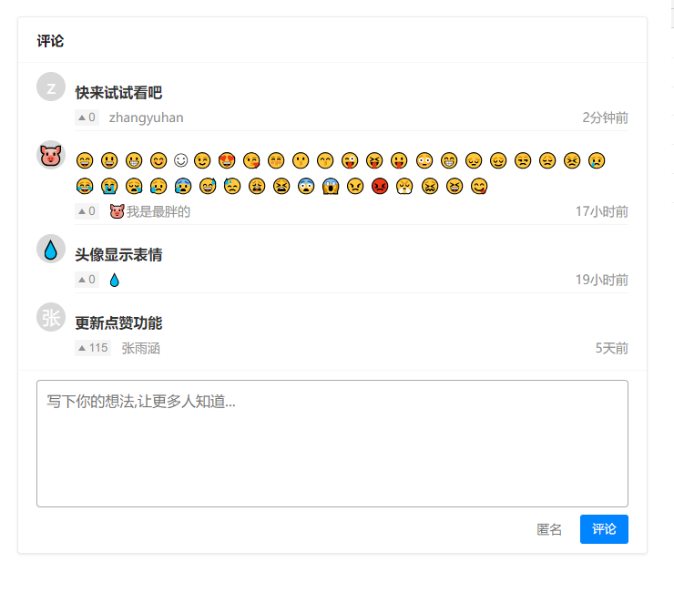

<div align="center">
  
  <h1>wilddog-disuss<br><em>基于野狗云的评论插件</em></h1>
  <div>
    <a href="https://github.com/zhangyuhan2016/wilddog-discuss/releases">
        
    </a>
    <a href="https://github.com/zhangyuhan2016/wilddog-discuss/commits/master">
        
    </a>
    <a href="#">
        
    </a>
    <a href="#">
        
    </a>
  </div>

  <p>仅在<code>Chrome 62+</code>测试使用,其他浏览器未经测试</p>
</div>

## 预览效果
0. 下载本地预览或编辑,这需要你进行一些准备工作[下载](https://github.com/zhangyuhan2016/wilddog-discuss/releases/download/v0.0.2/open.html)
1. [在线查看](https://zhangyuhan2016.github.io/article/new-blog.html)



## 准备工作
0.  注册[野狗云](https://www.wilddog.com)
1.  创建新应用 (实时通信引擎)
2.  获取SyncAppID

    0.  打开刚才创建的应用,url格式为console/xxxxxxxxx,其中xxxx就是SyncAppID
    1.  或者插入一条数据,会出现数据预览的链接和SyncAppID

## 思路简述
0.  引入野狗云SDK [js_SDK_2.5.8](https://cdn.wilddog.com/sdk/js/2.5.8/wilddog.js)
1.  获取数据
    
    ```javascript
    // 初始化
    wilddog.initializeApp(config);
    let ref = wilddog.sync().ref();
    let wid = location.pathname.split('/').pop().slice(0,-5) // 唯一ID
    let query = wilddog.sync().ref(wid);
    // 查询
    query.on('value',s => console.log(s.val()))
    // 根据属性查询 & 倒序
    query.orderByChild('h').limitToLast(5).on('value',s => console.log(s.val()))
    ```
2.  处理渲染数据   

## 使用插件
0.  引入js,css
    
    ```javascript
    /* 使用js添加样式 */
    let style = document.createElement('style')
    style.innerHTML = `#userSpeak{font-family:微软雅黑;width:600px;border:1px solid #ebebeb;box-shadow:0 1px 3px rgba(26,26,26,0.1);background:#fff;margin-top:12px;overflow:visible;border-radius:4px}#userSpeak .title{font-size:15px;font-weight:600;color:#1a1a1a;height:50px;line-height:50px;padding:0 20px;box-sizing:border-box;border-bottom:1px solid #f6f6f6}#userSpeak .note{width:600px;display:flex;flex-direction:row;align-items:flex-start;padding:10px 20px 0 20px;box-sizing:border-box}#userSpeak .note .head-img{width:32px;height:32px;min-width:32px;min-height:32px;border-radius:50%;background-color:#d8d8d8;line-height:32px;font-size:20px;text-align:center;color:white;margin-right:10px}#userSpeak .note .con-box{flex:1;display:flex;flex-direction:column;font-size:14px;color:#909090;line-height:28px;border-bottom:1px solid #f5f5f5;padding-top:8px;box-sizing:border-box}#userSpeak .note .con-box>strong{font-style:normal;color:#333;font-size:16px}#userSpeak .note .con-box .info{display:flex;flex-direction:row;align-items:center}#userSpeak .note .con-box .info>button{border:none;padding:0 4px;box-sizing:border-box;height:18px;position:relative;outline:none;text-indent:11px;line-height:18px;color:#909090;background:rgba(242,242,242,0.8);cursor:pointer}#userSpeak .note .con-box .info>button.ac{color:#007fff;pointer-events:none;background-color:rgba(0,127,255,0.1)}#userSpeak .note .con-box .info>button.ac::after{border-bottom:6px solid #007fff}#userSpeak .note .con-box .info>button::after{content:"";width:0;height:0;border-left:4px solid transparent;border-right:4px solid transparent;border-bottom:6px solid #909090;position:absolute;left:4px;top:6px}#userSpeak .note .con-box .info>em{font-style:normal;margin-left:0.8em}#userSpeak .note .con-box .info>time{flex:1;text-align:right}#userSpeak .note:last-child>.con-box{border-bottom:none}#userSpeak .speak{width:600px;display:flex;flex-direction:column;padding:10px 20px;box-sizing:border-box;border-top:1px solid #f6f6f6;margin-top:10px}#userSpeak .speak>textarea{resize:none;outline-color:#0084ff;box-shadow:none;background-color:#fff;box-sizing:border-box;height:5em;border-radius:4px;padding:10px;color:#333;font-size:16px;height:140px;overflow-y:hidden;line-height:24px;font-family:微软雅黑}#userSpeak .speak .name{width:100%;display:flex;flex-direction:row;align-items:center;justify-content:flex-end;margin-top:8px}#userSpeak .speak .name>input{outline-color:#909090;border:none;height:30px;padding:4px 10px;font-size:14px;background:#fff;box-sizing:border-box;width:8em;text-align:right;margin-right:10px;color:#909090}#userSpeak .speak .name>button{outline:none;color:#fff;background-color:#0084ff;padding:0 12px;line-height:30px;text-align:center;cursor:pointer;border:1px solid #0084ff;border-radius:3px;box-sizing:border-box}#userSpeak .speak .name>button:hover{border-color:#0077e6;background-color:#0077e6}#userSpeak .speak .name>button.ac{background:#d8d8d8;border-color:#d8d8d8;cursor:no-drop}`
    document.querySelector('head').appendChild(style)
    ```
1.  准备一个合适的Box,设置宽高,默认ID同上css **#userSpeak**
2.  初始化
    
    ```javascript
    new UserSpeak({
        selector: '#userSpeak', // box选择器
        sid: location.pathname.split('/').pop().slice(0, -5), // 页面ID
        num: 5, // 获取评论数量
        sync: false, // 实时同步
        config: {}  // wilddog配置
        // config: { syncURL: 'https://这里是你的SyncAppID.wilddogio.com' }
    })
    ```
